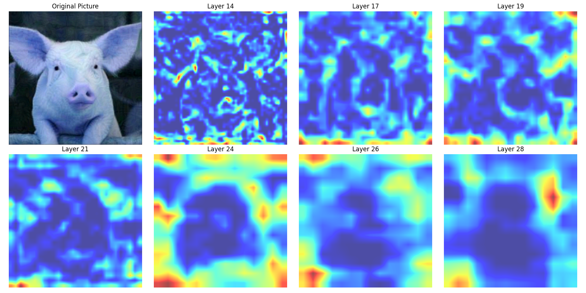
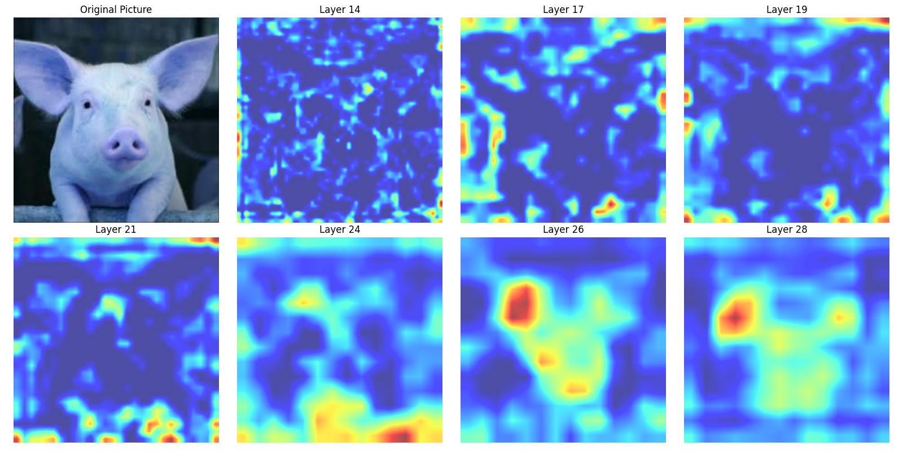
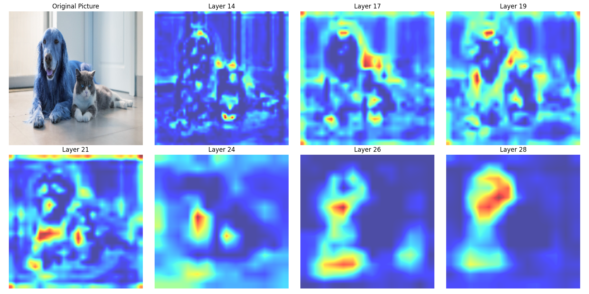

# Grad-CAM and Deconvolutional Visualization with PyTorch

PyTorch implementation of **Grad-CAM (Gradient-weighted Class Activation Mapping)** for understanding image classification models. This project demonstrates how to visualize the regions of an image that influence the model's predictions and provides insights into adversarial robustness.


---

## Features

* Visualizes **Grad-CAM heatmaps** for specific layers of a pretrained VGG16 model.
* Supports **Deconvolutional Visualization** to reconstruct input features from activations.
* Generates a **2x4 grid** combining the input image and Grad-CAM visualizations.
* Analyzes and visualizes adversarial examples to understand model vulnerabilities.


---


## Requirements

* Python 3.6 or higher
* PyTorch
* torchvision
* numpy
* opencv-python
* matplotlib
* click

Install the required dependencies with:

```bash
pip install torch torchvision numpy opencv-python matplotlib click
```

---


## Usage
```bash
python main.py [COMMAND] [OPTIONS]
```

### Commands
demo1: Generate Grad-CAM visualizations for specified images.
### Options
-i, --image-paths: Path(s) to input image(s). Multiple images can be provided (required).
-o, --output-dir: Directory to save the results (default: ./results).
--cuda/--cpu: Use GPU (CUDA) if available or force CPU.

Demo 1: Grad-CAM Visualization
Generate Grad-CAM visualizations for a pretrained VGG16 model.

```bash
python main.py demo1 -i [IMAGE_PATHS] -o [OUTPUT_DIR] [--cuda/--cpu]
```

## Adversarial Example Visualization

Below, we use **Grad-CAM** to visualize the model's decision-making process for an adversarial example and its correct classification.

### Input Explanation
- **Left Image:** Grad-CAM visualization of an adversarial example where the original image of a hog is perturbed to be classified as a "gibbon."
- **Right Image:** Grad-CAM visualization of the original (non-perturbed) image, correctly classified as "hog."

### Visualization

| Adversarial Example (Gibbon) | Correct Classification (Hog) |
|------------------------------|-------------------------------|
|  |  |

## Multi-object Image Analysis

Here, **Grad-CAM** is used to analyze an image containing both a golden retriever and a cat. The model predicts the image as a "golden retriever." Grad-CAM visualizations highlight the regions contributing to this decision.

### Input Explanation
- **Input Image:** An image containing both a golden retriever and a cat.
- **Prediction:** The model classifies the image as "golden retriever."
- **Grad-CAM Visualization:** The heatmap shows higher activations around the golden retriever, explaining its influence on the classification.

### Visualization

| Original Image with Grad-CAM Visualizations |
|---------------------------------------------|
|  |

In this visualization, the red regions correspond to areas that strongly influenced the model's classification. The high activations around the golden retriever explain why the model prioritized it over the cat.

## References

1. [Grad-CAM PyTorch Implementation by Kazuto Nakashima](https://github.com/kazuto1011/grad-cam-pytorch)
2. R. R. Selvaraju, A. Das, R. Vedantam, M. Cogswell, D. Parikh, and D. Batra. *Grad-CAM: Visual Explanations from Deep Networks via Gradient-based Localization*. Proceedings of the IEEE International Conference on Computer Vision (ICCV), 2017.
3. J. T. Springenberg, A. Dosovitskiy, T. Brox, and M. Riedmiller. *Striving for Simplicity: The All Convolutional Net*. arXiv preprint arXiv:1412.6806, 2014.
4. M. D. Zeiler, R. Fergus. *Visualizing and Understanding Convolutional Networks*. Proceedings of the European Conference on Computer Vision (ECCV), 2013.


